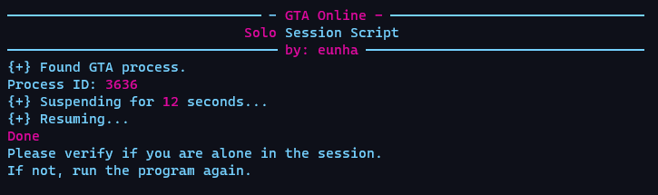

Sometimes, there's a bunch of a-holes killing us...<br>
Sometimes, you don't want other people interfering with your stuff...<br>
Sometimes, we just want to play alone... That's why I created:
# GTA Online - Solo Session Script


<p>Now you can do everything you would in a public session, but completely alone!</p>

---

## Tutorial
> <p>Before you do anything, you need to install Python. I recommend the latest version (3.9.1 <1/02/2021>) since that's what I'm using.<br>
> <b>If you're on Windows, make sure to check "Add python to path" or this won't run properly!</b>

> <p>After that, open a cmd by doing win+r and typing cmd<br>
> Copy and paste the code below and hit enter.<br>
```
pip install psutil rich
```

>Now you can download the .py file from the releases tab or through this link: [Latest Release](https://github.com/actuallyeunha/gtao_ssession-script/releases/download/v1.0/gta-sss.py "Download the latest release")
><p>Double click it <b>with the game already open and connected</b> and that's it!</p>

## Support me
> If you want to support me, please consider [buying me a coffee](https://www.buymeacoffee.com/actuallyeunha)! ☕<br>
